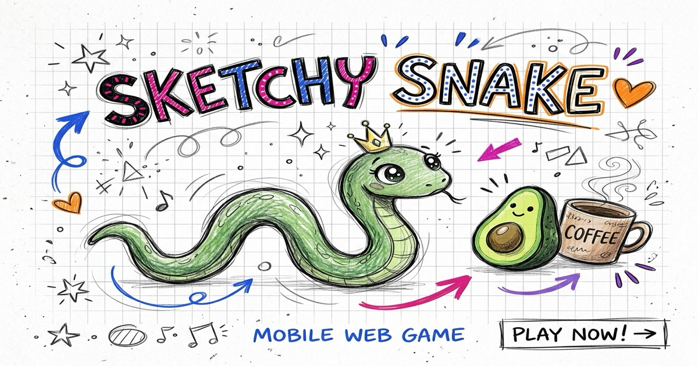

# ✏️ Sketchy Snake 🐍

<p align="center">
  
</p>

<p align="center">
  <strong>A hand-drawn arcade snake game built inside a living sketchbook spread with chill lo-fi beats, munchkins, and mobile haptics.</strong>
</p>

<p align="center">
  <a href="https://aunysillyme.github.io/sketchy-snake/"></a>
  <a href="https://aunysillyme.itch.io/sketchy-snake"></a>
  <a href="https://aunysillyme.github.io/sketchy-snake-vr/"></a>
  <a href="LICENSE"></a>
</p>

---

## 🎮 Quick Links

* **🌐 Web Playable (GitHub Pages):** [https://aunysillyme.github.io/sketchy-snake/](https://aunysillyme.github.io/sketchy-snake/)
* **🕹️ itch.io Release:** [https://aunysillyme.itch.io/sketchy-snake](https://aunysillyme.itch.io/sketchy-snake)
* **🥽 3D VR Edition (WebXR):** [https://aunysillyme.github.io/sketchy-snake-vr/](https://aunysillyme.github.io/sketchy-snake-vr/)

---

## 🎨 The 'Sketchy' Art Spec

Instead of a standard clean grid, **Sketchy Snake** is built to feel like an illustrator's open notebook:

* **Procedural Graphite Strokes:** Double-pass jittered quadratic bezier curves give every snake segment and boundary wall a textured hand-drawn pencil outline.
* **Warm Sketchbook Palette:** Creamy textured paper background (`#FCFAF6`), Cobalt Blue (`#1D4ED8`), Hot Magenta (`#DB2777`), Purple Ink (`#7E22CE`), and the signature Orange Heart (`#F97316` `🧡`).
* **Living Marginalia:** Floating doodle accents (sleeping black cat, potted plant, coffee cup, musical notes, and handwritten mantras like *"progress not perfection"* and *"coffee = fuel ⚡"*).

---

## 🥑 The Munchkin Food Menu

| Munchkin | Points | Special Effect |
|---|---|---|
| 🥑 **Avocado Head** | `+10` | Fresh & crispy snack |
| 🥒 **Cucumber Head** | `+15` | Crunchy patterned slice |
| 🎃 **Pumpkin Head** | `+20` | Autumn doodle bonus |
| 🥔 **Potato Head** | `+15` | Pure potato power |
| ☕ **Coffee Fuel** | `+30` | Speed combo + floating steam lines |
| 🧡 **Orange Heart** | `+50` | Signature brand score multiplier |

---

## 🎵 Interactive Lo-Fi Synthesizer

The game features an embedded, zero-dependency **Web Audio API synthesizer & sequencer** that generates chill lo-fi melodies in real time:

1. ⚡ **Blue Lightning** (124 BPM · Melodic synth arpeggios in Am / C)
2. 🌅 **Afterglow** (88 BPM · Sunset lo-fi chord progressions)
3. 🏃‍♀️ **Run Away** (120 BPM · Driving retro synth groove)

*Engineered with pre-buffered hardware audio loops for zero CPU overhead and 60 FPS gameplay on mobile devices.*

---

---

## 🕹️ Game Modes & Controls

### 1. 🐍 Classic Solo Mode
Slither across the graph paper, gobble munchkins, and build combo streaks!
* **Ink Shot / Shed Tail:** Press `[SPACE]` (desktop) or tap `✏️ INK` (mobile). When your snake has 4+ segments, you sacrifice 1 tail segment to shoot pencil lead forward to snipe erasers or escape tight traps.
* **Rogue Erasers 🧼:** Spawns after score 15. Erases 2 segments on contact, or sniped with ink shot for +40 bonus points.
* **Ghost Sketch Immunity ✨:** Pick up the glowing highlighter for 4s of immunity (pass through your own body).
* **Controls:** `WASD`, `Arrow Keys`, on-screen D-Pad, or Canvas Swipes.

### 2. ⚔️ Tron Duel Mode (2-Player Local)
A competitive two-player battle on the same device!
* **Permanent Trails:** Tails never shrink on their own — your drawn graphite line becomes a lethal wall your opponent must avoid.
* **Munchkin Erasers:** Eating munchkins in VS mode rubs out 5 tail segments, the only way to reclaim board space.
* **Double Smudge:** Simultaneous crashes are scored as an honorable draw.
* **Controls:**
  * **Player 1 (Cobalt Blue):** `W` `A` `S` `D` keys or on-screen D-Pad.
  * **Player 2 (Magenta Pink):** `Arrow Keys` or Canvas Swipe.

### 3. 🌐 Online Multiplayer Architecture (`server/`)
Includes an authoritative Node.js WebSocket server supporting room codes, matchmaking, spectators, and seat tokens.
To run the multiplayer server locally:
```bash
cd server
npm install
npm start
# Server listens on http://localhost:3000 (WebSocket & Static Files)
```

---

## 🌟 Community Shout-Outs & Contributor Credits

Big love to the community for contributing code, testing early builds, and giving game-changing feedback! 🧡

* **[@NFTaanon](https://github.com/cortexresearch)** / **[cortexresearch](https://github.com/cortexresearch/sketchy-snake)**:
  * **Contribution:** Designed and implemented the **Tron-style 2-Player Duel mode** (permanent trails, simultaneous crash detection, and eraser munchkins) and built the authoritative **WebSocket multiplayer server architecture** (`server/` + `net.js`).

* **[@someguy_112358](https://x.com/someguy_112358)**:
  > *"It's nice but maybe missing something besides the cool graphics to diferenciate it from other snakes. What if you added some powers, like shoting a part of itself or a immunity frame and some enemies or obstacles or something like that?"*
  * **Resulting Mechanics:** Inspired the **Ink Shot / Shed Tail** clutch survival mechanic, the **Rogue Eraser 🧼** hazard, and the **Ghost Sketch 🖍️** immunity power-up.

* **[@Soorena](https://x.com/Soorena)**:
  > *"the combo pop up blocks the items sometimes. maybe place the combo pop up outside of the game's frame?"*
  * **Resulting Fix:** Moved the floating **Combo Badge** outside the game frame to the right side underneath the scoreboard so munchkins and the snake are never obscured.

---

## 🚀 Local Development

No heavy build tools required. To run the game locally:

```bash
# Clone the repository
git clone https://github.com/aunysillyme/sketchy-snake.git
cd sketchy-snake

# Start a local HTTP server
python3 -m http.server 8080

# Open in browser
open http://localhost:8080
```

---

## 📱 Native Android & Capacitor Build

To compile as a native Android APK or Google Play App Bundle (`.aab`):

```bash
# Install dependencies
npm install

# Sync web assets to native Android project
npx cap sync android

# Open in Android Studio
npx cap open android

# Or build debug APK directly via Gradle
cd android && ./gradlew assembleDebug
```

### Release signing

The previously committed release keystores and passwords are exposed. Removing
them from the current checkout does **not** revoke copies or remove Git history.
Before distributing another release, replace/reset the applicable app-signing
or upload key with your distribution provider and retire the old identity.
Do not reuse the exposed keystore as a CI secret.

Release builds require these environment variables:

| Variable | Value |
|---|---|
| `ANDROID_KEYSTORE_PATH` | Absolute path to the replacement keystore **outside this repository** |
| `ANDROID_KEYSTORE_PASSWORD` | Keystore password |
| `ANDROID_KEY_ALIAS` | Signing key alias |
| `ANDROID_KEY_PASSWORD` | Signing key password |

Load the values from your secret manager/environment, then run
`cd android && ./gradlew bundleRelease`. Missing or partial signing configuration
fails clearly; debug builds require none of these values. Do not put passwords
in Gradle arguments, tracked files, or shell history.

For the Play Store AAB workflow, configure GitHub Actions secrets
`ANDROID_KEYSTORE_BASE64` (base64 contents of the replacement keystore),
`ANDROID_KEYSTORE_PASSWORD`, `ANDROID_KEY_ALIAS`, and `ANDROID_KEY_PASSWORD`.
The workflow restores the key under the runner's temporary directory with
restricted permissions and removes it after the build. No credentials are
included in the uploaded AAB artifact path.

---

## 📄 License

This project is licensed under the [MIT License](LICENSE) — free for personal, educational, and commercial use.

---

<p align="center">
  <em>“progress not perfection · duality is architecture 🧡”</em><br>
  <strong>Built with 🧡 by <a href="https://github.com/aunysillyme">Auny</a> (<a href="https://x.com/AunySillyMe">@AunySillyMe</a>)</strong>
</p>
